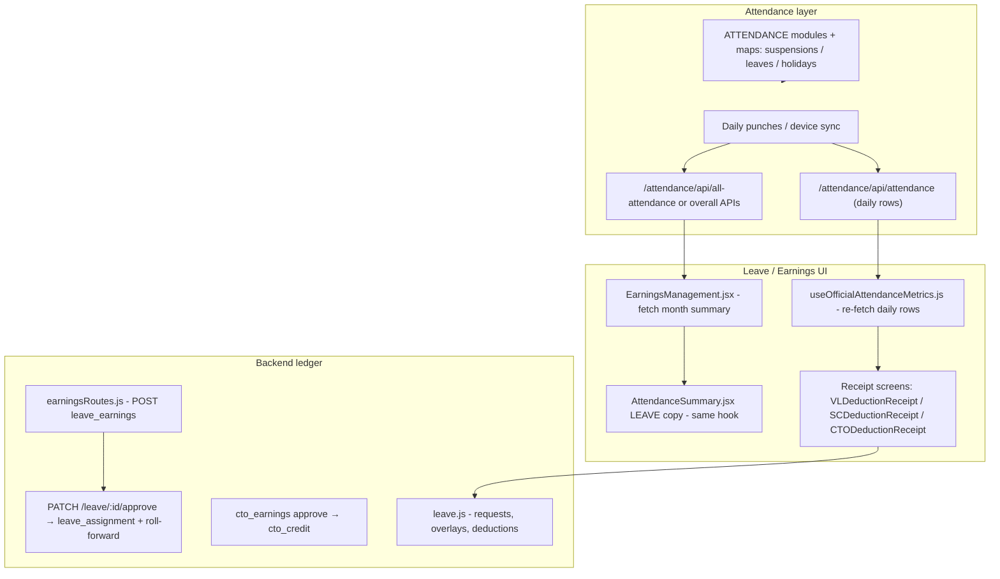

# Attendance → Leave flow, conflicts, and highest-risk issue

## End-to-end flow (as implemented today)

- **Attendance input**: punch data and “overall” aggregates come from attendance APIs ([`frontend/src/components/LEAVE/EarningsManagement.jsx`](frontend/src/components/LEAVE/EarningsManagement.jsx) tries [`/api/earnings/attendance/:employeeNumber`](frontend/src/components/LEAVE/EarningsManagement.jsx) then falls back to [`/attendance/api/overall_attendance_record`](frontend/src/components/LEAVE/EarningsManagement.jsx)).
- **Leave-side interpretation of attendance**: [`frontend/src/components/LEAVE/EARNINGS/useOfficialAttendanceMetrics.js`](frontend/src/components/LEAVE/EARNINGS/useOfficialAttendanceMetrics.js) calls [`/attendance/api/attendance`](frontend/src/components/LEAVE/EARNINGS/useOfficialAttendanceMetrics.js) with `personId` + date range and derives `absentDays`, `halfDays`, `lateHrs` for receipts (e.g. [`CTODeductionReceipt.jsx`](frontend/src/components/LEAVE/EARNINGS/CTODeductionReceipt.jsx)).
- **Calendar overlay (not accrual math)**: [`frontend/src/components/ATTENDANCE/attendanceLeaveIntegration.js`](frontend/src/components/ATTENDANCE/attendanceLeaveIntegration.js) loads approved leaves/holidays/suspensions so attendance UIs can label “ON LEAVE”.
- **Earnings / credits**: HR-driven creates in [`backend/routes/earningsRoutes.js`](backend/routes/earningsRoutes.js) (`INSERT INTO leave_earnings` with `earn_status = 'pending'`), then **approve** mutates [`leave_assignment`](backend/routes/earningsRoutes.js) (roll-forward, propagation, deductions). CTO follows a parallel path (`cto_earnings` → `cto_credit` on approve, same file region as your grep hits).
- **Leave consumption**: leave requests and HR approval paths live under [`backend/routes/leave.js`](backend/routes/leave.js); [`deduction_decision_log`](c:\Users\Admin\Downloads\earist_hris (44).sql) in your dump captures system recommendation vs final applied JSON.

---

## Conflicts and gaps (QA view)

| Area | What conflicts | Why it matters |
|------|----------------|----------------|
| **Attendance metrics (two implementations)** | [`AttendanceSummary.jsx`](frontend/src/components/ATTENDANCE/AttendanceSummary.jsx) counts half-days as `halfDays += 1` only (no `absentDays += 0.5`) and assigns **half schedule seconds** to `renderedSec` for one-session days; [`useOfficialAttendanceMetrics.js`](frontend/src/components/LEAVE/EARNINGS/useOfficialAttendanceMetrics.js) uses **`absentDays += 0.5`** and, for the incomplete-punch branch, **`renderedSec = 0`** before late deficit (different tardiness signal for the same raw rows). | Leave receipts and Attendance dashboards can **disagree on absence / tardiness** for identical employees and periods—bad for audits and for any auto-earnings tied to attendance. |
| **Dual / fallback attendance sources for earnings** | [`EarningsManagement.jsx`](frontend/src/components/LEAVE/EarningsManagement.jsx) primary vs fallback endpoints and date windows. | Same month can surface **different “official” summaries** depending on which API responds first. |
| **CSC “category rules” vs server trust** | Frontend hints in [`frontend/src/utils/earningsEmpCatRules.js`](frontend/src/utils/earningsEmpCatRules.js) (e.g. SC only for teaching-shaped categories; CTO broadly allowed). **Leave earnings POST** in [`earningsRoutes.js`](backend/routes/earningsRoutes.js) validates presence of fields and sign of hours, not **whether that employee category may earn VL/SL/SC/CTO**. | A compliant UI can still be bypassed via API or older clients → **wrong leave type accrual** (the core gap your discussion doc calls out). |
| **CTO double representation** | Your dump shows both [`cto_credit`](c:\Users\Admin\Downloads\earist_hris (44).sql) and [`cto_earnings`](c:\Users\Admin\Downloads\earist_hris (44).sql) for the same employee (`20131005`) and period-style data. Code path approves `cto_earnings` then inserts/updates `cto_credit`. | Risk of **double counting in reports** if any consumer sums both without understanding the lifecycle. |
| **`leave_assignment` typing** | Columns like `total_hours`, `remaining_hours`, `used_hours` are **VARCHAR** in the dump ([`leave_assignment` DDL](c:\Users\Admin\Downloads\earist_hris (44).sql)). | Explains artifacts like `1.6479999999999997` and makes **invariant checks** harder in SQL and in app code. |
| **HR override vs recommendation** | [`deduction_decision_log`](c:\Users\Admin\Downloads\earist_hris (44).sql) row 3: recommendation `recommended_rate_decimal: 0.5`, `recommended_hours: 5`, `hours_per_day: 10` but `final_applied_json` has `applied_rate_decimal: 1.2`, `applied_hours: 12`. | Proves the system **allows states that contradict its own half-day policy math**—compliance and payroll risk. |
| **Ledger plausibility** | [`leave_assignment`](c:\Users\Admin\Downloads\earist_hris (44).sql) id **9**: `VL` for `20133101`, `remaining_hours` `0`, `used_hours` **`71.08`** while `allocated_hours` **`0`** and carried/remaining on the order of **~1.65**. | This is not a minor rounding issue: it is **accounting-invalid** (usage far in excess of visible pool for that row). |

---

## Database: many related tables — is that a conflict?

**Having several tables is normal** for a leave/earnings domain: you split **transactional facts** (each earning line, each usage line), **running balances** (`leave_assignment`), **audit** (`earnings_audit_log`, `deduction_decision_log`), and **payroll fallout** (`leave_salary_shortfall`). That is not a design flaw by itself.

The **real conflicts** show up in how deletes and lifecycles are defined:

1. **No (or weak) foreign keys** — If tables are only linked by `employee_number` / loose IDs in application code, deleting “one row” in phpMyAdmin or a script leaves **orphans** (e.g. `leave_salary_shortfall.leave_earning_id` pointing at a deleted `leave_earnings` row). That feels like “I have to delete everywhere manually” because the database is **not** enforcing a single graph.

2. **Blind `ON DELETE CASCADE` everywhere** — One delete on a parent wipes children. That is convenient but **dangerous** for financial/audit tables unless you truly want history gone (often you want **soft delete**: `earn_status`, `voided_at`, or append-only logs).

3. **Derived pairs (e.g. CTO)** — `cto_earnings` (pending/approved **event**) vs `cto_credit` (**balance bucket**) is two layers on purpose. Deleting an earning row without reversing the balance update on `cto_credit` (or `cto_usage`) causes **double books** or **ghost balance**. The “too much connection” feeling here is really **missing documented delete/reversal rules** and ideally **one DB transaction or stored procedure** per business operation.

4. **Logs should usually outlive facts** — For `deduction_decision_log` / `earnings_audit_log`, prefer **`ON DELETE SET NULL`** on optional FKs to parent rows, or **never delete parents**—only void/correct with a new row—so you are not manually chasing five tables for a legal audit trail.

**Practical takeaway:** The burden of “delete one place, delete another” is reduced by **explicit FKs**, **chosen CASCADE vs RESTRICT vs SET NULL per relationship**, and **prefer void/reversal over physical delete** for anything that ever touched balances or payroll.

---

## Optional: one CTO table with a `type` / `entry_kind` column

**Yes, you can model CTO as a single append-only (or event) table** instead of separate `cto_earnings`, `cto_credit`, and `cto_usage` tables. Pattern: each row is a **ledger line** with something like `entry_kind` in `('ACCRUAL','USAGE','OFFSET','FORFEIT','ADJUSTMENT','REVERSAL')` and **signed hours** (positive adds to the pool, negative consumes), plus `employee_number`, `period_year`, `period_month`, `reference_id` (leave request, order no.), `status` (pending/approved if you still need workflow), and optional `expires_at`.

**Benefits**

- **Fewer joins and no duplicate “balance bucket”** if balance is always computed as `SUM(hours)` (or materialized in a view).
- **One place to delete/void** conceptually: insert a reversing row instead of touching credit + usage + earnings.
- **Clearer audit story**: full history is chronological lines.

**Tradeoffs**

- **Migration cost**: existing code in [`backend/routes/earningsRoutes.js`](backend/routes/earningsRoutes.js) and CTO UIs expects current tables; a merge is a **schema + API migration**, not a quick rename.
- **Pending approval workflow**: today `cto_earnings` may be `pending` while `cto_credit` is the posted balance; in one table you either use `entry_kind` + `status`, or keep **two logical types** (proposed accrual vs posted accrual) until approved.
- **Usage detail**: `cto_usage` today may store rich fields (`action`, `date_used`, `cto_credit_id`). A unified row still needs those columns (nullable) or a JSON `metadata` column—**one table does not mean one shape fits all** unless you normalize optional attributes.

**Recommendation:** A single **event-sourced ledger** is a sound design for greenfield or a deliberate v2; for your current app, treat it as a **migration project**: define balance as `SUM` rules per `entry_kind`, backfill from the three existing tables, then retire duplicate writers. Until then, **document** the current two-layer model so reports never sum `cto_earnings` and `cto_credit` as if they were independent pools.

---

## Highest problem (single answer)

**Leave balance and deduction integrity: the system does not reliably enforce accounting invariants on `leave_assignment` (and related logs), while simultaneously allowing powerful manual and override paths without a central policy layer.**

Evidence from your own dump is stronger than the architectural “no policy engine” concern alone: **`leave_assignment` row 9 (`20133101`, VL)** shows **used hours an order of magnitude above the credited pool on that assignment row**, alongside VARCHAR float noise. That class of defect directly impacts **pay correctness, CSC defensibility, and employee trust**. Split-brain attendance metrics and missing server-side category validation are **major contributing causes** and should be fixed, but **corrupt or impossible balances** are the production-severity apex.

---

## Suggested remediation direction (for a later implementation pass)

- Introduce a **single server-side `leavePolicyEngine`** (or equivalent module) invoked by: leave earnings create/approve, CTO/SC approve, and leave-request deduction application—enforcing **category → allowed leave types**, **max deductible vs remaining**, and **half-day / hours-per-day consistency**.
- **Unify attendance metrics** into one shared function used by both [`AttendanceSummary.jsx`](frontend/src/components/ATTENDANCE/AttendanceSummary.jsx) and [`useOfficialAttendanceMetrics.js`](frontend/src/components/LEAVE/EARNINGS/useOfficialAttendanceMetrics.js) (or delete one code path).
- Add **reconciliation queries / admin repair tooling** for rows where `used_hours` + `remaining_hours` ≉ `total_hours` (or per-period rules), and consider **DECIMAL columns** for hour fields on new migrations.
- **Delete semantics**: document each entity as append-only vs deletable; add FKs and either controlled CASCADE, RESTRICT (block bad deletes), or **service-layer “void earning”** that updates balances and logs in one transaction instead of manual multi-table deletes.

No code changes were made in this pass (plan-only mode).
